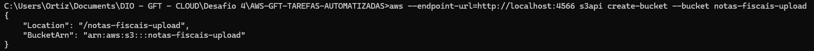
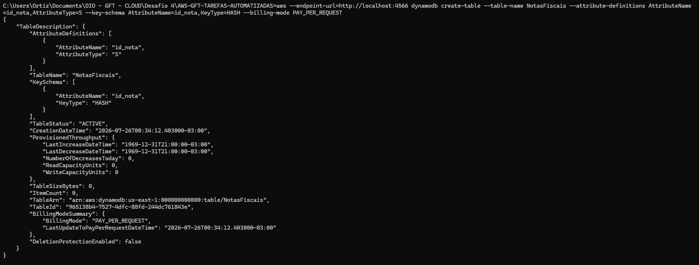
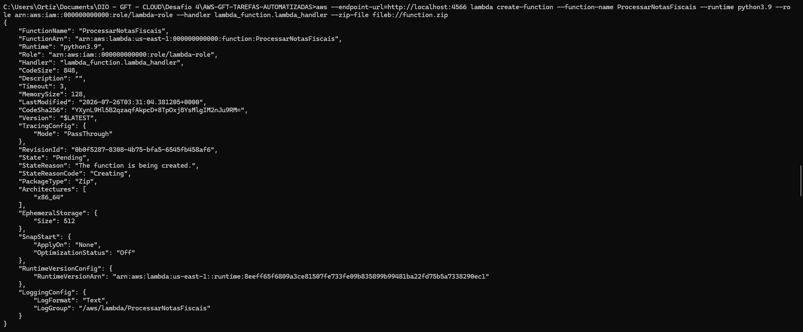
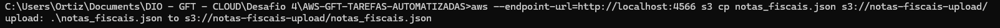
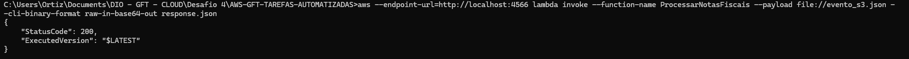
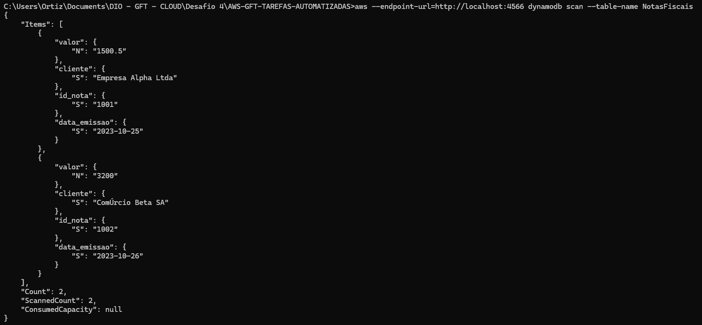

# Sistema de Processamento de Notas Fiscais com AWS Lambda, S3 e DynamoDB (LocalStack)

[](https://localstack.cloud/)
[](https://www.python.org/)
[](https://www.dio.me/)

Este repositório contém a solução prática desenvolvida para o desafio final do módulo **"Executando Tarefas Automatizadas com Lambda Function e S3"**, integrante do Bootcamp **GFT - Fundamentos de Cloud com AWS** da [Digital Innovation One (DIO)](https://www.dio.me/).

O objetivo do projeto é construir e simular uma arquitetura serveless e orientada a eventos (*Event-Driven Architecture*) localmente utilizando o **LocalStack**, realizando a ingestão de um arquivo JSON de notas fiscais via **Amazon S3**, seu processamento através de uma função **AWS Lambda** em Python, e a persistência dos dados extraídos no **Amazon DynamoDB**.

---

## Arquitetura da Solução

```
[ Usuário ] ──(Upload JSON)──> [ Amazon S3 ]
                                    │
                              (Trigger Event)
                                    │
                                    ▼
                          [ AWS Lambda (Python) ]
                         (Tratamento & Decimal)
                                    │
                             (Grava Registro)
                                    │
                                    ▼
                           [ Amazon DynamoDB ]
```

### Fluxo de Dados:
1. **Ingestão:** Upload do arquivo `notas_fiscais.json` para o bucket `notas-fiscais-upload` no Amazon S3.
2. **Processamento:** Invocação da Lambda `ProcessarNotasFiscais` passando o evento de notificação do S3.
3. **Transformação:** A função Lambda faz a leitura do arquivo no S3, efetua o *parsing* com suporte a tipos numéricos precisos (`Decimal`) e itera sobre os registros.
4. **Persistência:** Cada registro de nota fiscal é inserido na tabela `NotasFiscais` do DynamoDB.

---

## Tecnologias e Ferramentas

* **[LocalStack](https://localstack.cloud/):** Emulação local dos serviços de nuvem AWS (S3, Lambda, DynamoDB, IAM).
* **[AWS CLI v2](https://aws.amazon.com/cli/):** Interface de linha de comando para gerenciamento da infraestrutura simulada.
* **[Python 3.9](https://www.python.org/) & [Boto3](https://boto3.amazonaws.com/v1/documentation/api/latest/index.html):** Linguagem de programação e SDK oficial da AWS para interação com os serviços.
* **VS Code:** Ambiente de desenvolvimento integrado.

---

## Estrutura do Repositório

```text
.
├── images/
│   ├── create_bucket.png             # Evidência da criação do bucket S3
│   ├── create_dynamodb.png           # Evidência da criação da tabela DynamoDB
│   ├── create_lambda_function.png    # Evidência do deploy da função Lambda
│   ├── upload_notas_fiscais_json.png # Evidência do upload do JSON para o S3
│   ├── invoke.png                    # Evidência da invocação bem-sucedida da Lambda
│   └── dynamodb_scan.png             # Evidência do scan com dados salvos no DynamoDB
├── evento_s3.json                    # Payload de evento simulando trigger do S3
├── lambda_function.py                # Script Python executado na Lambda Function
├── notas_fiscais.json                # Arquivo fonte com dados das notas fiscais
├── response.json                     # Retorno da execução da Lambda Function
└── README.md                         # Documentação completa do projeto
```

---

## Passo a Passo de Execução

### 1. Inicialização do Ambiente Local
Certifique-se de ter o LocalStack em execução. Para evitar dependências do daemon Docker durante a execução da Lambda em ambiente de desenvolvimento, utilize a variável `LAMBDA_EXECUTOR=local`:

```bash
LAMBDA_EXECUTOR=local localstack start
```

### 2. Criação do Bucket S3
```bash
aws --endpoint-url=http://localhost:4566 s3api create-bucket     --bucket notas-fiscais-upload
```

### 3. Criação da Tabela DynamoDB
Criação da tabela `NotasFiscais` utilizando `id_nota` como chave primária (*Partition Key*):

```bash
aws --endpoint-url=http://localhost:4566 dynamodb create-table     --table-name NotasFiscais     --attribute-definitions AttributeName=id_nota,AttributeType=S     --key-schema AttributeName=id_nota,KeyType=HASH     --billing-mode PAY_PER_REQUEST
```

### 4. Upload do Arquivo de Dados
```bash
aws --endpoint-url=http://localhost:4566 s3 cp notas_fiscais.json s3://notas-fiscais-upload/
```

### 5. Deploy da Lambda Function
Empacotamento do script Python em arquivo `.zip` e criação da função no LocalStack:

```bash
zip function.zip lambda_function.py

aws --endpoint-url=http://localhost:4566 lambda create-function     --function-name ProcessarNotasFiscais     --runtime python3.9     --role arn:aws:iam::000000000000:role/lambda-role     --handler lambda_function.lambda_handler     --zip-file fileb://function.zip
```

### 6. Invocação e Processamento do Evento
Simulação do evento S3 enviando o payload JSON para a Lambda:

```bash
aws --endpoint-url=http://localhost:4566 lambda invoke     --function-name ProcessarNotasFiscais     --payload file://evento_s3.json     --cli-binary-format raw-in-base64-out     response.json
```

### 7. Validação da Persistência no DynamoDB
```bash
aws --endpoint-url=http://localhost:4566 dynamodb scan     --table-name NotasFiscais
```

---

## Evidências Práticas da Execução

### 1. Criação da Infraestrutura (S3 e DynamoDB)
Criação do bucket S3 `notas-fiscais-upload` e da tabela `NotasFiscais` no DynamoDB local.





---

### 2. Implantação e Upload de Dados
Criação da função Lambda `ProcessarNotasFiscais` e upload do arquivo `notas_fiscais.json` para o S3.





---

### 3. Invocação da Lambda e Validação Final
Execução da Lambda acionada pelo payload do S3 com retorno `StatusCode: 200` e verificação dos registros inseridos com sucesso na tabela DynamoDB.





---

## Anotações e Insights Adquiridos

Durante o desenvolvimento do desafio, foram enfrentados e solucionados diversos cenários práticos do dia a dia de engenharia de software e nuvem:

### 1. Manipulação de Formato de Entrada no AWS CLI v2 (`--cli-binary-format`)
* **Problema:** Na versão 2 do AWS CLI, o parâmetro `--payload` assume nativamente que o conteúdo enviado é uma string codificada em Base64, gerando o erro `Invalid base64`.
* **Solução:** A inclusão da flag `--cli-binary-format raw-in-base64-out` instrui o CLI a tratar o arquivo JSON como texto puro (*raw JSON*), garantindo o envio correto do payload sem a necessidade de conversões prévias.

### 2. Tipagem Numérica no Boto3 / DynamoDB (`TypeError: Float types are not supported`)
* **Problema:** Ao converter o JSON contendo valores monetários (ex: `1500.50`), a função padrão `json.loads` transforma esses números em objetos do tipo `float` do Python. O SDK `boto3` rejeita o tipo `float` na inserção no DynamoDB para evitar problemas de arredondamento de ponto flutuante.
* **Solução:** Utilização da classe `Decimal` da biblioteca nativa `decimal` do Python, passando `parse_float=Decimal` no método `json.loads(file_content, parse_float=Decimal)`. Isso garante precisão decimal exata e compatibilidade total com os tipos numéricos (`N`) do DynamoDB.

### 3. Gerenciamento de Ambientes de Execução LocalStack (`LAMBDA_EXECUTOR`)
* **Problema:** Por padrão, o LocalStack tenta criar um contêiner Docker isolado para cada execução de Lambda. Em ambientes onde o serviço do Docker não está ativo, a criação falha com o erro `Docker not available`.
* **Solução:** A configuração da variável de ambiente `LAMBDA_EXECUTOR=local` permite rodar o runtime da Lambda diretamente no processo local, facilitando o fluxo de testes rápidos sem dependência externa do Docker.

### 4. Codificação e Resposta do Payload (`UTF-8` vs `ASCII`)
* **Problema:** O uso de caracteres acentuados na serialização JSON (`json.dumps`) sem tratamento adequado de *encoding* gera sequências de *escape Unicode* (ex: `ã`), deixando a mensagem visualmente "quebrada" no arquivo de resposta.
* **Solução:** Padronização das mensagens de resposta em texto puro sem acentuação direta em logs/outputs de status, mantendo compatibilidade direta entre sistemas e facilidade na leitura de arquivos `response.json`.

---

## Conclusão

Este desafio consolidou conceitos fundamentais sobre arquitetura em nuvem serverless, integração entre serviços desacoplados (S3 + Lambda + DynamoDB) e o valor do **LocalStack** no ciclo de desenvolvimento de software, permitindo validar pipelines de dados de ponta a ponta com custo zero e resposta rápida antes de qualquer implantação em ambiente AWS real.

---

>  **Nota de Transparência:**
> A estrutura e a formatação deste `README.md` foram aprimoradas com o auxílio do **Google Gemini** como um recurso estético e de organização. O objetivo foi transformar a documentação técnica da arquitetura desenvolvida em um formato mais atrativo, legível e profissional para o portfólio. O trabalho em si foi feito por mim utilizando o conhecimento adquirido pelo curso e estudos próprios.
